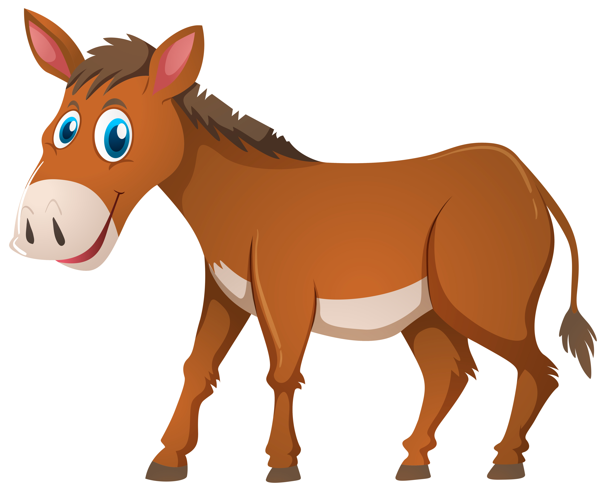

# Mule

Mule is a Go library that provides a convenient way to send UDP packets to multiple remote servers with unreachable ports and receive ICMP Destination/Port Unreachable packets from those servers. This can be useful for network diagnostics, port scanning, or other network-related tasks.


{width=600px}

## Features

- Send UDP packets to specified IP addresses and ports
- Receive and parse ICMP Destination Unreachable messages
- Configurable connection options (local IP, timeout, TOS, TTL, IPv4 flags)
- Easy-to-use API compatible with `net.Conn` interface

## Installation

To install Mule, use `go get`:

```
go get github.com/k0s-io/mule
```

## Usage

Here's a basic example of how to use Mule:

```go
package main

import (
	"context"
	"fmt"
	"net"
	"time"
)

func main() {
	muleConn, err := mule.New(
		mule.WithLocalIP("192.168.1.1"),
		mule.WithTimeout(5*time.Second),
		mule.WithTTL(64),
		mule.WithTOS(0),
		mule.WithIPv4Flag(0),
	)

    if err != nil {
        log.Fatalf("failed to create mule connection: %v", err)
    }

    defer muleConn.Close()

    // send a UDP packet
    _, err = muleConn.WriteToIP([]byte("Hello, Mule!"), "192.168.1.2", 1234, 80)
    if err != nil { 
        log.Fatalf("failed to send UDP packet: %v", err)
    }

    // read the ICMP response
    dstIP, srcPort, dstPort, err := muleConn.ReadFrom()
    if err != nil {
        log.Fatalf("failed to read ICMP response: %v", err)
    }
    
    fmt.Printf("received ICMP response: dstIP=%s, srcPort=%d, dstPort=%d\n", dstIP, srcPort, dstPort)

}


